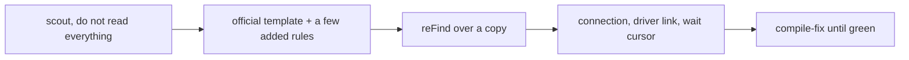

# FireDAC migration pack for reFind and IDE agents

Two agent skills and seven prompts for migrating a Delphi or C++Builder application from BDE, ADO, dbExpress or IBX to FireDAC, using `reFind.exe` and Embarcadero's official rule templates, both of which are included with RAD Studio.

The workflow is deliberately small:



reFind does the bulk renames, deterministically and in seconds. The agent does the parts a rule file cannot express: working out what you actually have, proposing the handful of project-specific rules, wiring up the connection, and grinding through the compile errors afterwards.

**These files are starting points, not a product.** The searches, the symbol lists and the structural checks assume a fairly ordinary business application. Expect to edit them for your own conventions; that is the intended use, and each file says which parts most often need it.

## What is in here

| Path | What it is |
|------|------------|
| [skills/firedac-migrate/](skills/firedac-migrate/) | The whole workflow as an agent skill, plus a per-stack reference: detection symbols, template paths, driver links, and the leftovers each stack produces |
| [skills/refind-rulesmith/](skills/refind-rulesmith/) | How to draft additive reFind rules, plus a reference for the directive grammar, the command-line switches and the behaviour that catches people out |
| [prompts/](prompts/) | The same workflow as seven copy-paste prompts, for running a step at a time or with an agent that has no skill support |
| [templates/](templates/) | A Migration Brief skeleton, an additive rule block to paste at the end of a template, and a batch file that copies a tree and runs reFind over the copy |
| [install-skills.ps1](install-skills.ps1) | Copies the skills where your agent will find them |

## Requirements

- RAD Studio, Delphi or C++Builder. `reFind.exe` is in the `bin` folder of every install.
- **Samples installed.** The official rule templates live under `C:\Users\Public\Documents\Embarcadero\Studio\<ver>\Samples\Object Pascal\Database\FireDAC\Tool\reFind`. Samples are optional at setup; if that folder is missing, add them through the installer or Feature Manager before starting. This pack does not ship copies of those files, because the ones on your machine match your version.
- An agent that can read your project and run commands. [Kai](https://www.embarcadero.com/products/rad-studio/kai) runs inside the IDE, which matters most in the last step, where the agent needs to see real compiler output.
- Your project in version control, on a branch.

## Installing the skills

```powershell
.\install-skills.ps1
```

That copies both skills to `%USERPROFILE%\.agents\skills`, which is the cross-client Agent Skills convention.

| Agent | Location | After copying |
|-------|----------|---------------|
| Kai | `%USERPROFILE%\.agents\skills` | Start a **new** chat so the skills are read, and switch to Agent mode |
| Codex CLI | `%USERPROFILE%\.agents\skills`, or `.agents\skills` in the repository | Picked up on the next run |
| Gemini CLI | `~/.gemini/skills` or `~/.agents/skills` | `/skills reload`, then `/skills list` to confirm |
| Claude Code | `~/.claude/skills`, or `.claude/skills` in the project | New session |

Other options:

```powershell
.\install-skills.ps1 -Agent claude                    # ~\.claude\skills
.\install-skills.ps1 -Scope Project -Path C:\src\App  # commit them with the project
.\install-skills.ps1 -Scope Custom -Path D:\skills    # somewhere else entirely
```

For other agents: check where it looks for `SKILL.md` folders. `.agents/skills` is the convention most clients now read, and a skill is only a folder, so copying it somewhere else works just as well.

If your setup has no skill support at all, copy [AGENTS.md](AGENTS.md) into your project root and work through [prompts/](prompts/) by hand. Nothing here depends on skills existing.

## Using it

With the skills installed, describe the job and let the agent follow the workflow:

> Migrate this project from BDE to FireDAC using reFind. Scout first, and stop after the Migration Brief.

Without skills, or when you want to run one step at a time, use [prompts/](prompts/) in order. Prompt 0 finds `reFind.exe` and the templates and tells you whether you can start at all. Prompt 1 produces a Migration Brief you should read carefully, because the rest of the day is shaped by it.

Either way: work on a branch, migrate a copy of the sources, and read the rule file before it runs.

## What this does not do

- **It does not migrate automatically.** Every step produces something for you to review, and two of them stop and ask.
- **It does not rewrite unsupported APIs.** The official templates document, in comments, the APIs with no FireDAC equivalent. The skills treat that list as a checklist and refuse to invent rules for it. Those are your decisions.
- **It does not move data.** The migration is purely for components and code. This tool doesn't migrate data between DB engines IE: Paradox -> InterBase.
- **A green build is not a finished migration.** The connection definition, driver link and wait cursor fail at runtime, not at compile time.
- **Very large or unusual codebases will need a hardening pass.** The part this reliably collapses is the mechanical bulk work and the first compiling baseline.

## Why the rule templates are not in this repo

`FireDAC_Migrate_BDE.txt` and its ADO, dbExpress and IBX counterparts ship with RAD Studio and are updated with it. A copy vendored here would drift out of date and would be wrong for anyone on a different version. Both skills and all the prompts therefore resolve the template from your installation and copy it before making changes, so the file inside the Samples tree stays untouched.

## Licence

MIT, see [LICENSE](LICENSE). The reFind utility, the rule templates and the sample projects referenced here are Embarcadero's and are covered by your RAD Studio licence.
